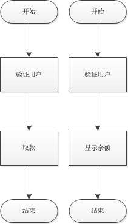
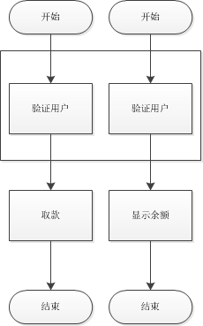

# spring 框架

## 简介
spring 框架解决了业务逻辑层和其他各层的松耦合问题，将面向接口编程贯穿整个系统应用。 现在的Spring框架已经成为构建企业级Java应用事实上的标准了。


这张图摘自 Spring 官网，意思为将你的 POJO 放入 Spring，让 Spring 为你管理你的对象，在你需要的时候为你实例化

## 装配 Bean

装配 Bean 有三种方式

* XML 方式显示配置

* Java 中显示配置

* 隐式的 Bean 扫描机制和自动装配

## XML 方式自动装配 Bean

新建一个 beans.xml 文件，加入一下代码：
```
<?xml version="1.0" encoding="UTF-8"?>
<beans xmlns="http://www.springframework.org/schema/beans"
    xmlns:xsi="http://www.w3.org/2001/XMLSchema-instance"
    xsi:schemaLocation="http://www.springframework.org/schema/beans
        http://www.springframework.org/schema/beans/spring-beans.xsd">

<!-- 在这里添加代码 -->
    
</beans>
```

在里面添加一个 bean
`<bean id="myBean" class="core.MyBean"></bean>`

这样我们就可以将 core 包下的 MyBean 交给 Spring 来管理，在我们需要的时候 Spring 会为我们提供相应的对象

现在我们来使用他，需要在上下文中获得
```
ApplicationContext ctx = new ClassPathXmlApplicationContext("beans.xml");
MyBean my = (MyBean) ctx.getBean("myBeans");
my.send();
```

## Java 代码装配 Bean

通过 Java 代码装配 Bean 需要一个配置类

Config.java
```
@Configuration
public class Config {
	@Bean
	public MyBean createMyBean() {
		return new MyBean();
	}
}

```

获得上下文方式改变了：
```
ApplicationContext con = new AnnotationConfigApplicationContext(Config.class);
		MyBean b = con.getBean(MyBean.class);
		b.send();
```
## 自动装配 Bean

配置类中加入注解： @ComponentScan 和 @Configuration

获得上下文:
```
ApplicationContext ctx = new ClassPathXmlApplicationContext("beans.xml");
	        
MyBean my = (MyBean) ctx.getBean("myBean");
my.send();
```

@ComponentScan 注解是启用组件扫描，如果没有其他配置，会默认扫描与配置列相同的包。可以在注解中设置参数，具体可进入源码查看

在 beans.xml 配置文件中添加自动扫描包路径
`<context:component-scan base-package="core" />`


***

## 面向切面编程 (AOP)

### 简介

AOP 是 Spring 框架中一个重要的内容，将应用各模块可以重用的地方隔离出来，使得业务逻辑各部分之间耦合度降低，提高可重用性。



ATM 自动取款机有两种流程，一种是查询余额，还有一种是取款，我们发现这两者有相同的验证流程



如果我们把这个共有的部分提取出来，写代码的时候就不需要每次都考虑加入验证用户的功能了，只需要写一次，在需要的时候 Spring 帮助我们添加过去，而不需要自己复制粘贴，在修改代码的时候特别方便，这就是 AOP 的好处

Spring基于动态代理，所以Spring只支持方法连接点。

## AOP 相关术语

### 通知 (Advice)

Spring 切面有 5 种类型的通知：

* 前置通知 (Before): 在目标方法被调用之前调用通知功能

* 后置通知 (After): 在目标方法被调用之后调用通知功能

* 返回通知 (After-returning): 在目标方法成功执行之后调用通知

* 异常通知 (After-throwing): 在目标方法抛出异常后调用通知

* 环绕通知 (Around): 通知包裹了被通知的方法，在被通知的方
法调用之前和调用之后执行自定义的行为。

### 连接点 (Join point)

连接点是在应用执行过程中能够插入切面的一个点。这个点可以是调用方法时、抛出异常时、甚至修改一个字段时。切面代码可以利用这些点插入到应用的正常流程之中，并添加新的行为。

### 切点 (Pointcut)

切点的定义会匹配通知所要织入的一个或多个连接点。通常使用明确的类和方法名称，或是利用正则表达式定义所匹配的类和方法名称来指定这些切点。